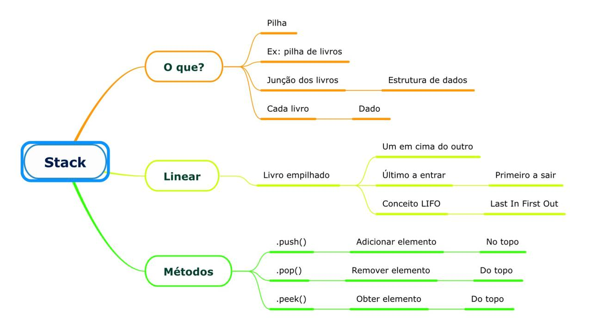

## Stack

Stack é Pilha. É como uma se fosse uma pilha de livro (um livro em cima do outro).

A junção de todos os livros, montam uma estutura de dados. O dado em si é cada livro.

Isso é linear (como um livro acima do outro). O último a entrar na pilha é o primeiro a sair. Esse conceito é chamado de LIFO (Last In First Out)

## Stack no código

### Métodos

- push() - adicionar um elemento à pilha
- pop() - remover o elemento do topo da pilha
- peek() - obter o elemento do topo da pilha
- size() - mostrar o tamanho da pilha, quantos elementos tem dentro

